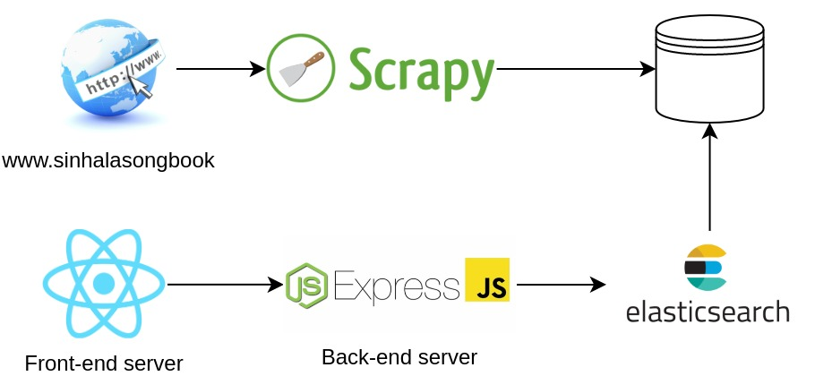
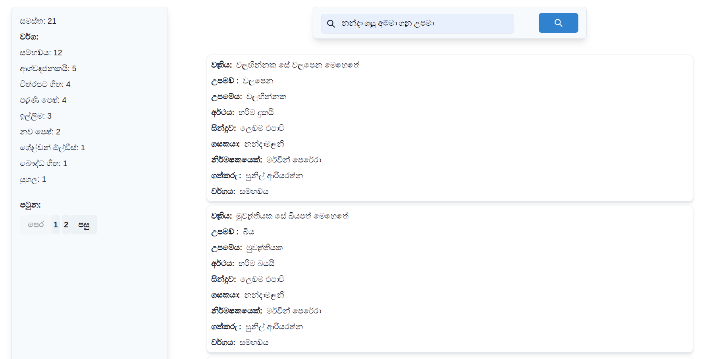

# sinhala-song-search

The search engine allows for searching metaphors and their explanations for Sinhala song lyrics. Additionally, you can
retrieve metaphors using other attributes like song artist, composer, or genre.

The tech stack of the project can be summarized with the following diagram:



## Features



### Supported Queries

1. Pagination - the client application fetches the most fundamental results first, and let the user decide if
   he wants more.
2. Aggregation - displays how many hits per each genre for an entered query.
3. Field Boosting - the backend boost the fields after detecting specific keywords for the respective columns. These keywords are described in `backend/res/keywords.json`. Some examples include,
   1. `නන්දා ගැයු අම්මා ගැන උපමා` - metaphors sung by නන්දා මාලනී.
   2. `සුනිල් ආරියරත්න රචිත නන්දා ගැයු උපමා` - metaphors written by සුනිල් ආරියරත්න and sung by නන්දා මාලනී.
   3. `මේ සිංහල අපගෙ රටයි ගීතයේ උපමා ` metaphors in the song මේ සිංහල අපගෙ රටයි ගීතයේ උපමා .
4. Sorting and Ranging - the user can search find the most popular results by indicating the term popular in the query.
   For instance, `එඩ්වඩ් ජයකොඩි ගැයු ප්‍රසිද්ධම උපමා 2` will return the two of the most popular metaphors sung by the
   artist.

### Elasticsearch Analyzers

1. The `stop words` are obtained from https://github.com/nlpcuom/Sinhala-Stopword-list. These words are regularly
   repeated and does not add much value to the query. Since they are not accounted for the indexing, the performance of
   elasticsearch can be improved.
2. The `stem words` are obtained from https://github.com/rksk/sinhala-news-analysis/tree/master/sinhala-stemmer. Stemmer
   ensures to cluster the words of having the same semantic interpretation. Hence, the indexing time is reduced
   while expanding the combination of user inputs.
3. A sample `synonm words` is generated for the search engine considering a few instances of phrases. This allows user
   to search indexed terms with their synonyms.

## Retrieving Song Lyrics

The project uses `scrapy` to crawl the song lyrics from the site, https://www.sinhalasongbook.com/. To retrieve the
songs from the site,

`bash ./crawl.sh`

The bash script will scrape the songs from the site and converts into Sinhala Unicode at `corpus/sinhala_songs.json`.
After, the data is annotated with metaphors and stored at `corpus/annotated_sinhala_songs.json`.

### The Dataset

Currently, there are 102 annotated metaphors with the following fields available
at `corpus/annotated_sinhala_songs.json`, and it contains the following fields:

1. Title - Title of the song
2. Arist - An array of artists of the song
3. Composer - An array of composers of the song
4. Writer - An array of writers of the song
5. Genre - The genre of the song
6. Metaphor - An array of metaphors of the song
    1. Line - The complete line of the metaphor
    2. Source - The source of the metaphor
    3. Target - The target of the metapor
    4. Meaning - The interpretation of the metaphor

## Setting up the Application

### Creating the Elasticsearch Index

By default, the Elasticsearch is set to run on the local machine, `http://localhost:9200`. Specify the credentials in
the following line at both `elasticsearch/create_index.py` and  `elasticsearch/create_index.py` if necessary.

```py
es = Elasticsearch('http://localhost:9200')
```

Execute `python3 elasticsearch/create_index.py` to create an index in Elasticsearch. After,
execute `python3 elasticsearch/bulk_data.py` to populate the data set.

### Setting up the Web Application

The application uses React as the frontend and Express as the backend whcih communicates to Elasticsearch. To install
the necessary dependencies of both applications, run

```bash
(yarn --cwd client install) & (npm i --prefix backend) && wait
```

After, execute the following command to run both applications.

```bash
(yarn --cwd "client" start) & (npm start --prefix "backend") && wait
```


